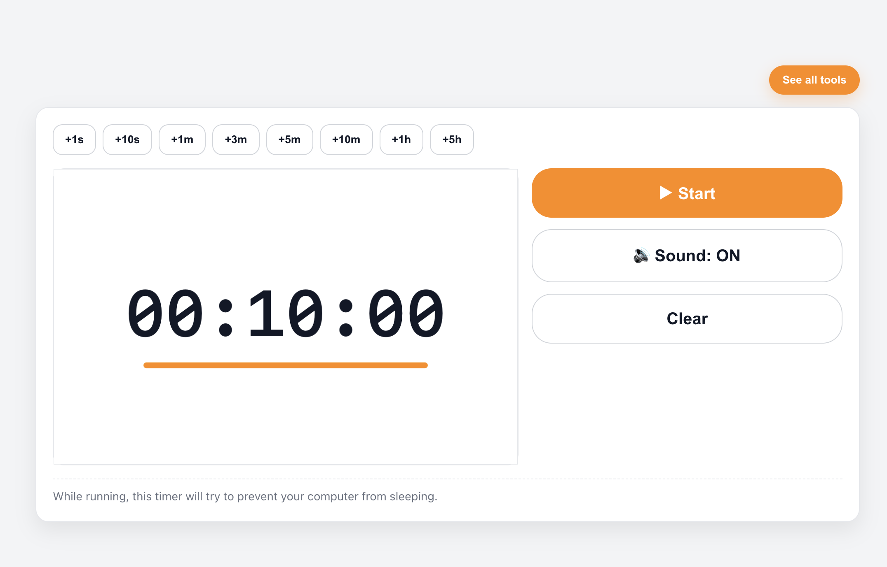

# ⏱️ DevTools Timer

A **privacy-first online countdown timer** built for developers, students, and productivity enthusiasts.  
No data leaves your computer — everything runs **100% locally in the browser**.

🔗 **Live Demo:** [https://timer.sk-project.link](https://timer.sk-project.link)

---

## ✨ Features

- 🎨 **Large Canvas Display** — easy to see while coding or presenting
- ⚡ **Quick-Add Buttons** — add +1s, +10s, +1m, +5m, +1h, etc. instantly
- 🔊 **Audible Signals** — beeps before, during, and after timer completion
- 🌙 **Wake Lock Support** — prevents your computer from sleeping while running
- 🛡 **Privacy-First** — no tracking, no metrics, no server requests
- 🖥 **Responsive UI** — works on desktop and mobile
- ♿ **Accessible** — ARIA labels, keyboard focus, and high-contrast design

---

## 📷 Screenshots

> **Main Panel**
>
> 

## 🚀 Getting Started

### 1. Clone the repository
```bash
git clone https://github.com/sk-project-code/timer-dev-tool.git
cd timer-dev-tool
